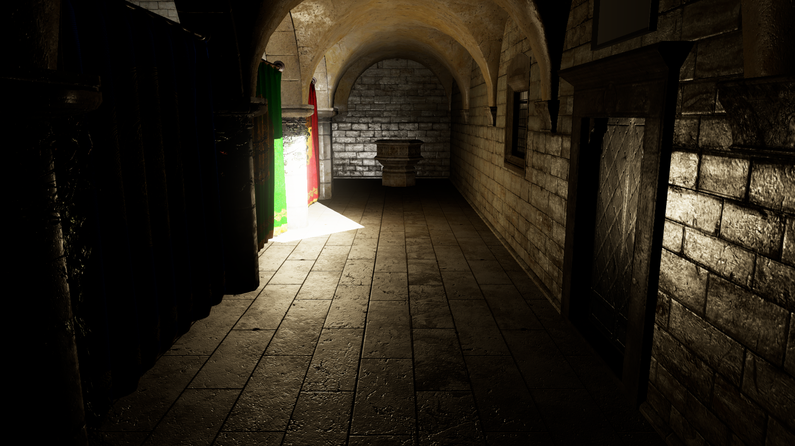

# Fast Indirect Illumination Using Two Virtual Spherical Gaussian Lights

This is an improved implementation of "*[Fast Indirect Illumination Using Two Virtual Spherical Gaussian Lights](https://yusuketokuyoshi.com/#Fast_Indirect_Illumination_Using_Two_Virtual_Spherical_Gaussian_Lights)*" on [Microsoft MiniEngine](https://github.com/microsoft/DirectX-Graphics-Samples).
This method generates two *[virtual spherical Gaussian light sources](https://yusuketokuyoshi.com/#Virtual_Spherical_Gaussian_Lights_for_Real-time_Glossy_Indirect_Illumination(PG2015))* (VSGLs) to roughly approximate single-bounce indirect illumination.

## Method Overview

 - Approximate diffuse-to-diffuse, diffuse-to-glossy, glossy-to-diffuse, and glossy-to-glossy reflections
 - Completely dynamic, no precomputation and no lookup tables
 - Specialized for scenes locally lit by a spotlight

### Algorithm

 1. [Render a reflective shadow map](https://github.com/yusuketokuyoshi/VSGL/blob/master/ModelViewer/Shaders/ReflectiveShadowMapPS.hlsl)
 2. [Generate a diffuse VSGL and glossy VSGL from the reflective shadow map](https://github.com/yusuketokuyoshi/VSGL/blob/master/ModelViewer/Shaders/VSGLGenerationCS.hlsli)
 3. [Compute lighting from the two VSGLs](https://github.com/yusuketokuyoshi/VSGL/blob/master/ModelViewer/Shaders/LightingPS.hlsl)

### Limitations

 - Light leaks
 - No indirect shadows
 - Lack of illumination details due to the rough approximation

## Requirements

 - [Visual Studio 2019](https://visualstudio.com/) with [Windows 10 SDK](https://developer.microsoft.com/en-US/windows/downloads/windows-10-sdk/)
 - Shader Model 6.0 capable GPU

## Build and Run

 1. Open `ModelViewer/ModelViewer_VS16.sln`
 2. Select configuration: Debug (full validation), Profile (instrumented), Release
 3. Build and run

## Controls

### Camera
 - Forward/Backward/Strafe: left thumbstick or WASD (FPS controls)
 - Up/Down: triggers or E/Q
 - Yaw/Pitch: right thumbstick or mouse

### Light
 - Forward/Backward/Strafe: left thumbstick or WASD (FPS controls) **+ left mouse button**
 - Up/Down: triggers or E/Q **+ left mouse button**
 - Yaw/Pitch: right thumbstick or mouse **+ left mouse button**

### Others
 - Toggle slow movement: click left thumbstick or lshift
 - Open debug menu: back button or backspace 
 - Navigate debug menu: dpad or arrow keys
 - Toggle debug menu item: A button or return
 - Adjust debug menu value: dpad left/right or left/right arrow keys

## License

This software is released under the MIT License, see [`LICENSE.txt`](https://github.com/yusuketokuyoshi/VSGL/blob/master/LICENSE.txt).
