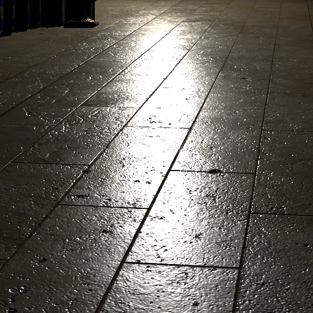
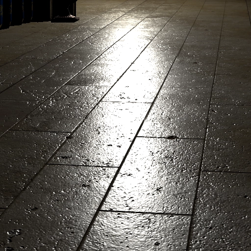

# Fast Indirect Illumination Using Two Virtual Spherical Gaussian Lights

This is an improved implementation of "*[Fast Indirect Illumination Using Two Virtual Spherical Gaussian Lights](https://yusuketokuyoshi.com/#Fast_Indirect_Illumination_Using_Two_Virtual_Spherical_Gaussian_Lights)*" on [Microsoft MiniEngine](https://github.com/microsoft/DirectX-Graphics-Samples).
It roughly approximates virtual point lights (VPLs) with two *[virtual spherical Gaussian lights](https://yusuketokuyoshi.com/#Virtual_Spherical_Gaussian_Lights_for_Real-time_Glossy_Indirect_Illumination(PG2015))* (VSGLs) for real-time single-bounce indirect illumination.

## Method Overview

 - Approximate diffuse-to-diffuse, diffuse-to-glossy, glossy-to-diffuse, and glossy-to-glossy reflections
 - Completely dynamic, no precomputation and no lookup tables
 - Specialized for scenes locally lit by a spotlight

### Algorithm

 1. [Generate VPLs by rendering a reflective shadow map](https://github.com/yusuketokuyoshi/VSGL/blob/master/ModelViewer/Shaders/ReflectiveShadowMapPS.hlsl)
 2. [Approximate the VPLs into a diffuse VSGL and glossy VSGL](https://github.com/yusuketokuyoshi/VSGL/blob/master/ModelViewer/Shaders/VSGLGenerationCS.hlsli)
 3. [Compute lighting from the two VSGLs](https://github.com/yusuketokuyoshi/VSGL/blob/master/ModelViewer/Shaders/LightingPS.hlsl)

### Accurate Spherical Gaussian (SG) Lighting

We use an accurate SG lighting method presented in "*[Hierarchical Light Sampling with Accurate Spherical Gaussian Lighting](https://yusuketokuyoshi.com/#Hierarchical_Light_Sampling_with_Accurate_Spherical_Gaussian_Lighting)*" (SIGGRAPH ASIA 2024 Conference Paper).
For the GGX microfacet BRDF under sharp SG lights, this method produces higher-quality highlights than the conventional anisotropic SG lighting method [[Xu et al. 2013](https://doi.org/10.1145/2508363.2508386)].

||||
|:---:|:---:|:---:|
|Anisotropic SG lighting [[Xu et al. 2013](https://doi.org/10.1145/2508363.2508386)]|Our SG lighting [[Tokuyoshi et al. 2024](https://yusuketokuyoshi.com/#Hierarchical_Light_Sampling_with_Accurate_Spherical_Gaussian_Lighting)]|Reference|

### Limitations

 - Light leaks
 - No indirect shadows
 - Lack of illumination details due to the rough approximation

## Requirements

 - Windows 10 version 2004
 - [Visual Studio 2019](https://visualstudio.com/) with [Windows SDK](https://developer.microsoft.com/en-us/windows/downloads/windows-sdk/)

## Getting Started

 1. Open `ModelViewer/ModelViewer.sln`
 2. Select configuration: Debug (full validation), Profile (instrumented), Release
 3. Build and run

## Controls

### Camera
 - Forward/Backward/Strafe: left thumbstick or WASD (FPS controls)
 - Up/Down: triggers or E/Q
 - Yaw/Pitch: right thumbstick or mouse

### Light
 - Forward/Backward/Strafe: left thumbstick or WASD (FPS controls) **+ left mouse button**
 - Up/Down: triggers or E/Q **+ left mouse button**
 - Yaw/Pitch: right thumbstick or mouse **+ left mouse button**

### Others
 - Toggle slow movement: click left thumbstick or lshift
 - Open debug menu: back button or backspace 
 - Navigate debug menu: dpad or arrow keys
 - Toggle debug menu item: A button or return
 - Adjust debug menu value: dpad left/right or left/right arrow keys

## License

This software is released under the MIT License, see [`LICENSE.txt`](https://github.com/yusuketokuyoshi/VSGL/blob/master/LICENSE.txt).
